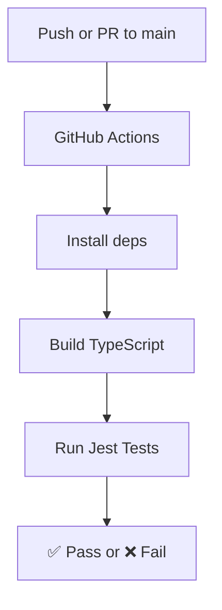

# 🚀 My TypeScript App

A simple starter template for TypeScript projects with GitHub Actions CI/CD.

---

## 📂 Project structure
```
src/        → TypeScript source code
tests/      → Unit tests with Jest
dist/       → Compiled JavaScript (after build)
.github/    → GitHub Actions workflow
```

---

## ⚡ Getting Started

### 1. Clone the repository
```bash
git clone https://github.com/your-username/my-typescript-app.git
cd my-typescript-app
```

### 2. Install dependencies
```bash
npm install
```

### 3. Run the project
```bash
npm start
```

Output:
```
👋 Hello, GitHub! Welcome to TypeScript 🚀
```

---

## 🧪 Run Tests
```bash
npm test
```

---

## 🔄 Continuous Integration

Every push and pull request to `main` runs automatically:
- ✅ Install dependencies  
- ✅ Build the TypeScript project  
- ✅ Run tests  

Check [Actions tab](../../actions) for logs.

---

## 🌟 Visual Flow



---

Made with ❤️ and TypeScript 🟦
